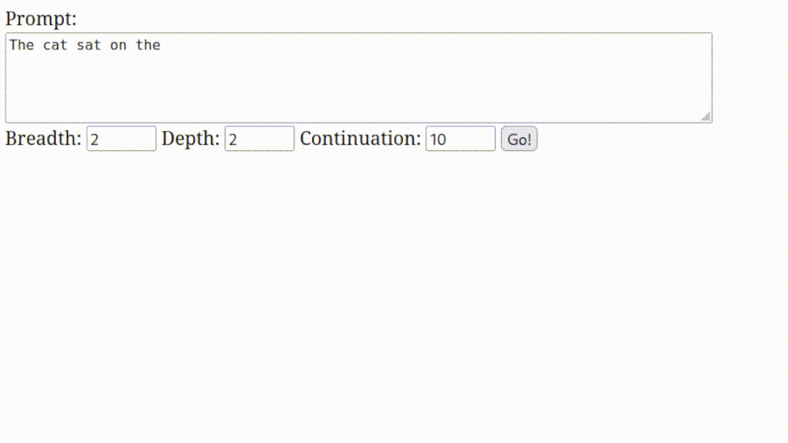
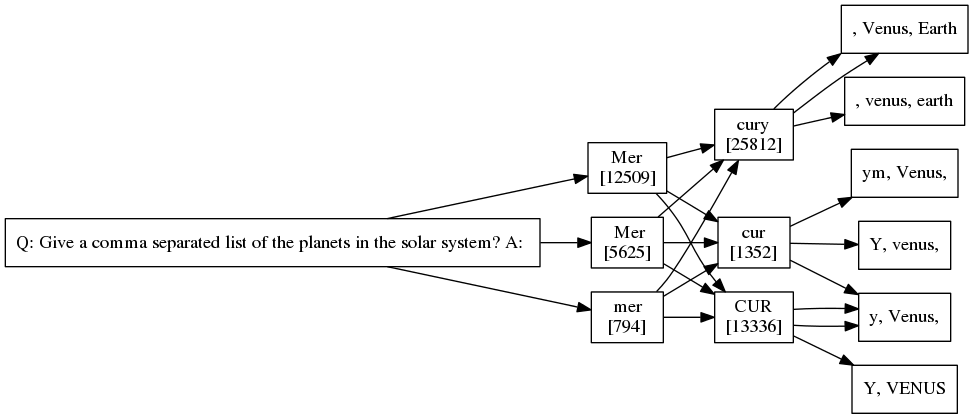
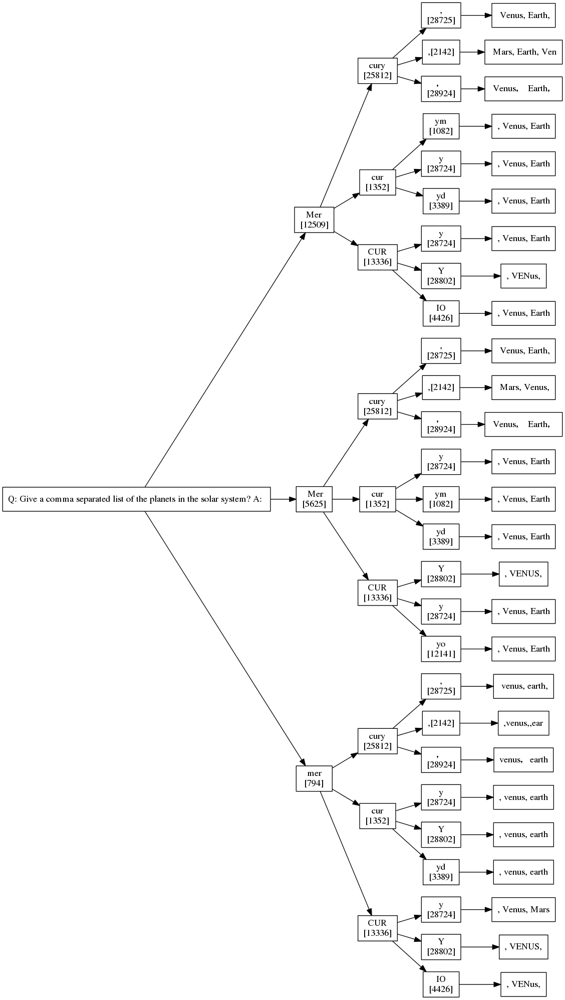
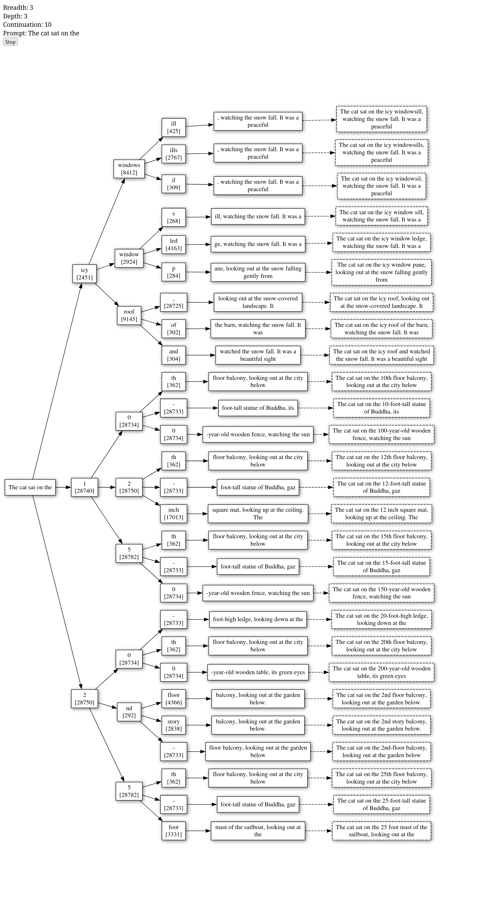

# Explorations on visualizing LLM workings.

> Demonstrates token generation by showing a tree of possible top-choice tokens at each step. Presented as a web interface.

## Various WIP Example Outputs

